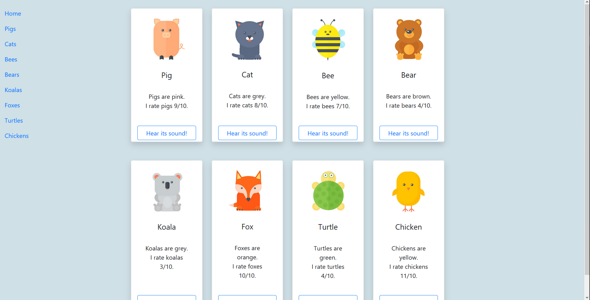

# Bootstrap Challenge
Learning about CSS frameworks - Bootstrap

---

Made by Erin Joosen

Made for educational purposes

---

# Preview

---

This project aimed to introduce CSS frameworks to beginning web developers. We were instructed to recreate an image using bootstrap and to not alter the css manually. There were extra requirements such as
- A side navbar that disappeard when the view became too small
- Tooltips on each button

I have succeeded mostly though there are some responsiveness issues. I will attempt to correct the collapsing issues. 

This repository was made to share my learning with my peers and coaches at BeCode. 

---

# License

All content has been created by me for specific use with this project. Don't reuse it please.  
